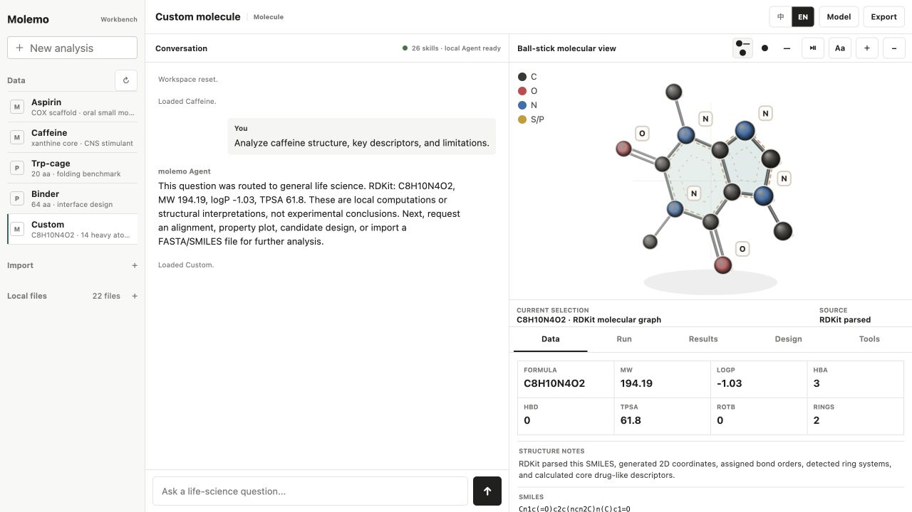
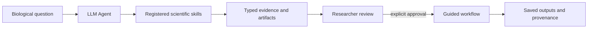

<div align="center">

# Molemo WorkBench

**An open-source AI scientist workbench for life science.**

Ask a biological question. Molemo turns it into local tool calls, reviewable plans,
scientific artifacts, and reproducible evidence.

[](https://github.com/phenixace/Molemo_WorkBench/actions/workflows/ci.yml)
[](benchmarks/tasks.jsonl)
[](.github/workflows/ci.yml)
[](environment.yml)
[](LICENSE)

**26 scientific skills · 50 tools · 23 guided workflows · local-first · bring your own LLM**

[Quick start](#quick-start) · [Showcase](showcase/README.md) · [Capability matrix](docs/CAPABILITY_MATRIX.md) · [Roadmap](docs/ROADMAP.md) · [简体中文](README.zh-CN.md)

</div>



Molemo lets an LLM do more than answer life-science questions. The Agent can use real scientific tools for molecules, proteins, structures, genomics, omics, literature, public databases, and bioinformatics while every input, tool call, approval, result, and caveat stays visible to the researcher.

It is built for a simple idea:

> **A scientific Agent should not hide the path from question to evidence.**

## Why Molemo

| | What it means in practice |
| --- | --- |
| **Real scientific tools** | RDKit, BLAST+, HMMER, MAFFT, BWA, samtools, bcftools, PyDESeq2, Scanpy, Reactome, STRING, and fixed public-data clients run behind structured skills. |
| **Inspectable evidence** | Molecules, structures, alignments, QC, matrices, plots, variants, citations, manifests, and provenance remain reviewable artifacts rather than disappearing into chat. |
| **Researcher control** | Multi-step or mutating workflows stop at a concrete plan and require explicit approval in the local WorkBench. |
| **Local-first, model-optional** | The scientific runtime works without an API key. Add any compatible model in native tool-calling or grounded mode when useful. |
| **Bounded claims** | Computed descriptors, database scores, exploratory clusters, variant calls, and structural proximity are kept distinct from experimental or clinical conclusions. |

## From question to evidence



1. Ask a question or open a local scientific object.
2. The Agent selects a bounded read-only skill or proposes a concrete workflow.
3. Inspect the exact inputs, assumptions, tools, and planned steps.
4. Approve execution only when the plan is ready.
5. Continue from inspectable evidence, not an opaque answer.

The Agent cannot execute arbitrary shell commands. Approval-only tools are not exposed to third-party models.

## Runnable showcase

These examples exercise real code paths and have explicit expected signals:

| Example | What actually runs | Expected signal |
| --- | --- | --- |
| **Caffeine** | RDKit SMILES parsing, molecular graph, rings, and descriptors | `C8H10N4O2`, 14 heavy atoms, MW `194.19` |
| **Trp-cage** | Protein sequence normalization, properties, and hydropathy | 20 aa sequence profile |
| **DNA truth set** | Approval → BWA-MEM → sorted/indexed BAM → samtools QC → bcftools VCF | `molemo_demo_reference:1201 A>C`, `0/1`, VAF `0.50` |

```bash
python -m molemo.showcase
python -m molemo.showcase --full
```

The full showcase also executes the PyDESeq2 bulk RNA-seq and Scanpy single-cell examples and writes `reports/showcase.json`. These are bounded demonstrations, not production cohort or clinical validation.

## What is implemented

### Molecules, proteins, and structures

- RDKit molecular graphs, bond orders, rings, descriptors, property views, and interactive 2D/3D-style rendering.
- Protein sequence properties, hydropathy, pairwise alignment, local BLASTP/BLASTN, HMMER domain search, and MAFFT family-site conservation.
- RCSB experimental structures, AlphaFold DB models with pLDDT and directional PAE, local PDB/mmCIF parsing, and exact variant-site contact review.

### Genomics and omics

- Streaming FASTQ QC and a bounded paired-end FASTQ-to-BAM/VCF truth-set workflow.
- Raw-count bulk RNA-seq differential expression with PyDESeq2.
- Raw-count CSV/TSV, AnnData, and 10x single-cell exploration with Scanpy, optional Scrublet, UMAP, Leiden, and marker ranking.
- Processed multi-sample VCF review with explicit depth/VAF rules, mutation matrices, sample QC, and longitudinal trajectories.

### Public evidence

- NCBI GEO discovery and approval-gated official Series Matrix import with structural QC and provenance.
- ChEMBL bioactivity, Open Targets target evidence, Reactome/STRING functional analysis, and Europe PMC literature maps.
- ClinicalTrials.gov landscapes and exact posted-results review.
- ClinVar, Ensembl VEP, and gnomAD variant evidence; PubChem, UniProtKB, RCSB, and AlphaFold DB records.

See the [capability matrix](docs/CAPABILITY_MATRIX.md) for exact inputs, outputs, limits, and planned tracks.

## Quick start

```bash
git clone https://github.com/phenixace/Molemo_WorkBench.git
cd Molemo_WorkBench
conda env create -f environment.yml
conda activate molemo-bench
python server.py
```

Open [http://127.0.0.1:8765](http://127.0.0.1:8765).

If your existing Python environment already provides the dependencies, `python -m molemo` starts the same server. Python 3.11 or newer is required.

## Bring your own model

Molemo works locally without a third-party LLM. To connect one, open **Model settings** and provide a complete OpenAI-compatible Chat Completions endpoint, model name, tool mode, and your own API key.

- **Native tool calling** lets the model select Agent-callable local skills.
- **Grounded chat** computes the active molecule or protein locally before sending the required result to a model without tool support.

The key is held only in page memory and the current local request. It is not written to disk or included in exported run records. The provider path has been smoke-tested with `MiniMax-M3`, including native local tool calling, language selection, artifact return, and removal of provider `<think>` blocks from user-visible output.

## Evaluation

```bash
python bench.py
python -m unittest discover -s tests -v
```

The committed `Molemo_Bench v0.22` baseline passes **151 tests** and **39/39 deterministic benchmark tasks**. The benchmark covers tool correctness, approval boundaries, trace completeness, provenance, and artifact generation. It is a process evaluation, not a claim of general scientific intelligence.

## Repository map

```text
molemo/             Python Agent, scientific clients, and workflow runtime
skills/             Auto-discovered skill manifests and handlers
tools/              Isolated analysis runners
workspace/examples/ Versioned synthetic and small reference fixtures
showcase/           Reproducible English and Chinese demonstrations
benchmarks/         Deterministic Molemo_Bench tasks
tests/              Unit, integration, and workflow-boundary tests
docs/               Architecture, capability matrix, and roadmap
```

The companion [Molemo IDE](https://github.com/phenixace/Molemo) connects this runtime to an editor-side research panel for VS Code and Cursor.

## Scope and safety

Molemo is a research workbench, not a clinical system. It does not provide diagnosis or treatment recommendations, turn exploratory outputs into biological truth, or infer causality from database scores.

The current FASTQ-to-BAM/VCF case uses a small synthetic reference and emits unfiltered research candidates. Production human WGS/WES, FASTQ-to-expression, metagenomics, proteomics, pathology slides, laboratory automation, hosted collaboration, and cloud execution remain roadmap tracks rather than current claims. GEO Series Matrix values are never silently treated as raw counts, and approval-gated workflows remain local researcher decisions.

Read the [roadmap](docs/ROADMAP.md) and [architecture](docs/ARCHITECTURE.md) for the next milestones and trust boundaries.

## Project note

Molemo is an independent open-source project inspired by the emerging AI scientist and life-science Agent paradigm. It is not affiliated with OpenAI Rosalind and does not depend on GPT-Rosalind.

## License

[MIT](LICENSE)
