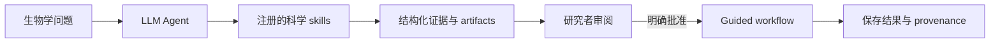

<div align="center">

# Molemo WorkBench

**面向生命科学的开源 AI Scientist WorkBench。**

提出一个生物学问题，Molemo 会把它转化为本地工具调用、可审阅计划、
科学 artifact 与可复现证据。

[](https://github.com/phenixace/Molemo_WorkBench/actions/workflows/ci.yml)
[](benchmarks/tasks.jsonl)
[](.github/workflows/ci.yml)
[](environment.yml)
[](LICENSE)

**26 个科学 skills · 50 个工具 · 23 类 guided workflows · 本地优先 · 自带 LLM**

[快速开始](#快速开始) · [可运行案例](showcase/README.zh-CN.md) · [能力矩阵](docs/CAPABILITY_MATRIX.zh-CN.md) · [路线图](docs/ROADMAP.zh-CN.md) · [English](README.md)

</div>


Molemo 让 LLM 不只是回答生命科学问题。Agent 可以调用真实科学工具处理分子、蛋白质、结构、基因组、组学、文献、公共数据库与生物信息学任务，同时把每个输入、工具调用、审批、结果和限制保留给研究者检查。

它围绕一个简单主张构建：

> **科学 Agent 不应该隐藏从问题到证据的路径。**

## 为什么是 Molemo

| | 实际意味着什么 |
| --- | --- |
| **真实科学工具** | RDKit、BLAST+、HMMER、MAFFT、BWA、samtools、bcftools、PyDESeq2、Scanpy、Reactome、STRING 与固定公共数据客户端都通过结构化 skills 运行。 |
| **证据可以检查** | 分子、结构、比对、QC、矩阵、图表、变异、引用、manifest 与 provenance 不会消失在 Chat 中，而是保留为可复核 artifact。 |
| **研究者掌握执行权** | 多步骤或会写入结果的 workflow 先停在具体计划，只有本地 WorkBench 中的明确审批才能开始执行。 |
| **本地优先、模型可选** | 不提供 API key 也能使用科学 runtime；需要时可连接支持 native tool calling 或 grounded chat 的兼容模型。 |
| **不夸大结论** | 计算描述符、数据库得分、探索性 cluster、候选变异和结构邻近不会被包装成实验或临床结论。 |

## 从问题到证据



1. 提出问题，或打开一个本地科学对象。
2. Agent 选择有界的只读 skill，或提出一个具体 workflow。
3. 检查准确输入、假设、工具和计划步骤。
4. 计划准备好后，由研究者明确批准执行。
5. 从可检查证据继续研究，而不是从一段不可追溯的回答继续。

Agent 不能执行任意 shell 命令；需要审批的执行工具不会暴露给第三方模型。

## 可运行案例

这些案例运行真实代码路径，并具有明确的预期信号：

| 案例 | 实际运行内容 | 预期信号 |
| --- | --- | --- |
| **咖啡因** | RDKit SMILES 解析、分子图、环系统与描述符 | `C8H10N4O2`、14 个重原子、MW `194.19` |
| **Trp-cage** | 蛋白序列规范化、理化性质与疏水性 | 20 aa 序列画像 |
| **DNA 合成真值** | 审批 → BWA-MEM → 排序/索引 BAM → samtools QC → bcftools VCF | `molemo_demo_reference:1201 A>C`、`0/1`、VAF `0.50` |

```bash
python -m molemo.showcase
python -m molemo.showcase --full
```

完整 showcase 还会实际执行 PyDESeq2 bulk RNA-seq 与 Scanpy single-cell 案例，并写入 `reports/showcase.json`。这些是有界的可复现实例，不是生产队列或临床验证。

## 已实现能力

### 分子、蛋白与结构

- RDKit 分子图、键级、环、描述符、性质视图与交互式 2D/3D 风格渲染。
- 蛋白序列性质、疏水性、pairwise alignment、本地 BLASTP/BLASTN、HMMER domain search 与 MAFFT 家族位点保守性。
- RCSB 实验结构、带 pLDDT 和方向化 PAE 的 AlphaFold DB 模型、本地 PDB/mmCIF 解析及精确变体位点接触审阅。

### 基因组与组学

- 流式 FASTQ QC，以及有界的 paired-end FASTQ-to-BAM/VCF 合成真值 workflow。
- 基于 raw counts 的 PyDESeq2 bulk RNA-seq 差异表达。
- 面向 raw-count CSV/TSV、AnnData 和 10x 的 Scanpy 单细胞探索，可选 Scrublet、UMAP、Leiden 与 marker ranking。
- 带明确 depth/VAF 规则、mutation matrix、sample QC 和纵向轨迹的 processed multi-sample VCF 审阅。

### 公共证据

- NCBI GEO 发现，以及经审批的官方 Series Matrix 导入、结构性 QC 与 provenance。
- ChEMBL bioactivity、Open Targets 靶点证据、Reactome/STRING 功能分析与 Europe PMC 文献图谱。
- ClinicalTrials.gov 临床试验版图和精确 posted-results 审阅。
- ClinVar、Ensembl VEP、gnomAD 变异证据，以及 PubChem、UniProtKB、RCSB、AlphaFold DB 记录。

每项能力的准确输入、输出、限制与规划状态见[能力矩阵](docs/CAPABILITY_MATRIX.zh-CN.md)。

## 快速开始

```bash
git clone https://github.com/phenixace/Molemo_WorkBench.git
cd Molemo_WorkBench
conda env create -f environment.yml
conda activate molemo-bench
python server.py
```

打开 [http://127.0.0.1:8765](http://127.0.0.1:8765)。

如果现有 Python 环境已经包含所需依赖，`python -m molemo` 可以启动同一个服务。需要 Python 3.11 或更新版本。

## 连接自己的模型

Molemo 不连接第三方 LLM 也可以使用。要启用模型，在 **Model settings** 中填写完整的 OpenAI-compatible Chat Completions endpoint、模型名、tool mode 和自己的 API key。

- **Native tool calling**：模型选择 Agent 可调用的本地 skills。
- **Grounded chat**：本地先计算当前分子或蛋白，再把必要结果交给不支持 tools 的模型。

Key 只存在当前页面内存与单次本地请求中，不写入磁盘，也不会进入导出的运行记录。Provider 路径已经使用 `MiniMax-M3` 完成 smoke test，覆盖 native 本地工具调用、界面语言选择、artifact 返回，以及从用户可见回复中移除 provider `<think>` 内容。

## 评测

```bash
python bench.py
python -m unittest discover -s tests -v
```

当前提交的 `Molemo_Bench v0.22` 基线通过 **151 项测试**和 **39/39 项确定性 benchmark tasks**。评测覆盖工具正确性、审批边界、trace 完整性、provenance 和 artifact 生成；它是过程评测，不代表通用科学智能。

## 仓库结构

```text
molemo/             Python Agent、科学客户端与 workflow runtime
skills/             自动发现的 skill manifests 与 handlers
tools/              隔离的分析 runners
workspace/examples/ 版本化的合成和小型参考数据
showcase/           可复现的中英文演示
benchmarks/         确定性 Molemo_Bench tasks
tests/              单元、集成与 workflow 边界测试
docs/               架构、能力矩阵与路线图
```

配套的 [Molemo IDE](https://github.com/phenixace/Molemo) 把这一 runtime 连接到 VS Code 和 Cursor 中的编辑器侧研究面板。

## 范围与安全边界

Molemo 是研究 WorkBench，不是临床系统。它不提供诊断或治疗建议，不把探索性输出包装成生物学真值，也不从数据库得分直接推断因果关系。

当前 FASTQ-to-BAM/VCF 案例使用小型合成参考并输出未经临床过滤的研究候选。生产级人类 WGS/WES、FASTQ-to-expression、宏基因组、蛋白组、病理切片、实验室自动化、托管协作和云端执行仍是路线图，而不是当前版本的能力声明。GEO Series Matrix 不会被静默当作 raw counts，需要审批的 workflow 始终由本地研究者决定是否执行。

下一阶段目标与 trust boundaries 见[路线图](docs/ROADMAP.zh-CN.md)和[架构说明](docs/ARCHITECTURE.zh-CN.md)。

## 项目说明

Molemo 是受 AI Scientist 与 life-science Agent 新范式启发的独立开源项目。它不隶属于 OpenAI Rosalind，也不依赖 GPT-Rosalind。

## License

[MIT](LICENSE)
